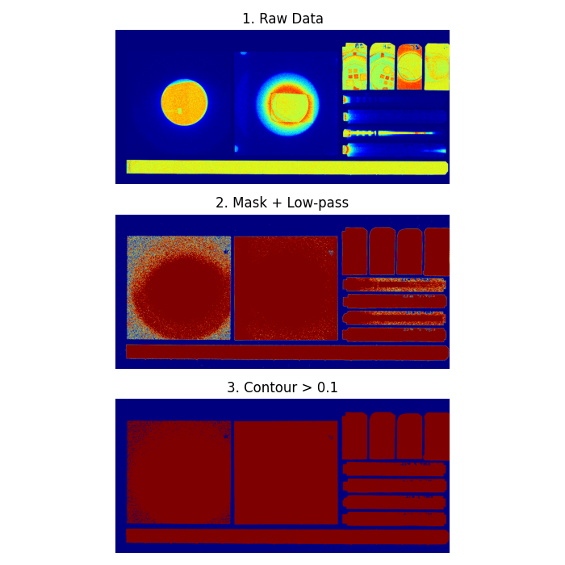
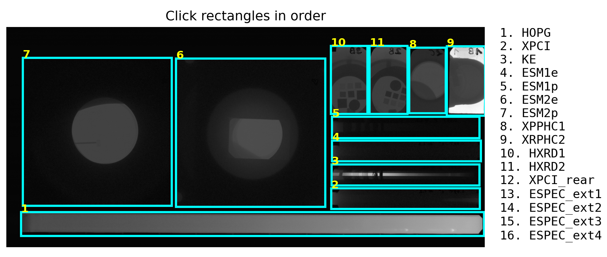

# IP Scan Processor

This code detects rectangles in an IP scan using OpenCV and crops the data to these rectangles.

## Screenshots:





## Usage - `process.py`

Edit the following code at the bottom of `process.py` and specify your relevant IP scan file you want to crop and save. Then run the code.

**Note** - Rectangle detection works best in the raw non-PSL corrected .tif file. Specify the raw.tif file in `scan_file_path` (for rectangle detection) and then specify the _PSL.tif file in `image_to_crop`.

The steps are outlined in the comments.

```python
# 1. Rectangle detection works best using non-PSL .tif - use this file to obtain rectangle coordinates
scan_file_path = Path("data/shot06-[Phosphor].tif")
rectangles = get_rectangles(scan_file_path, show_steps=True)

# 2. Use the detected rectangles to crop the actual PSL (photo-stimulated luminescence) image
image_to_crop = Path("data/shot06-[Phosphor]_PSL.tif")

# 3. Specify filenames of output cropped images. You will click these in order of dispalyed images.
filenames = [
    "HOPG",
    "XPCI",
    "KE",
    "ESM1e",
    "ESM1p",
    "ESM2e",
    "ESM2p",
    "XPPHC1",
    "XRPHC2",
    "HXRD1",
    "HXRD2",
    "XPCI_rear",
    "ESPEC_ext1",
    "ESPEC_ext2",
    "ESPEC_ext3",
    "ESPEC_ext4"
    ]

# 4. In this function you will click on rectangles in order of specified filenames in the list. The scan will be cropped to the selected rectangles and output as individual images. 
interactive_crop_and_save(
    image_path=image_to_crop, 
    rectangles=rectangles, 
    filenames=filenames, 
    output_folder=Path("output/images"),
    save=False,
    save_jpeg=True,
    )
```